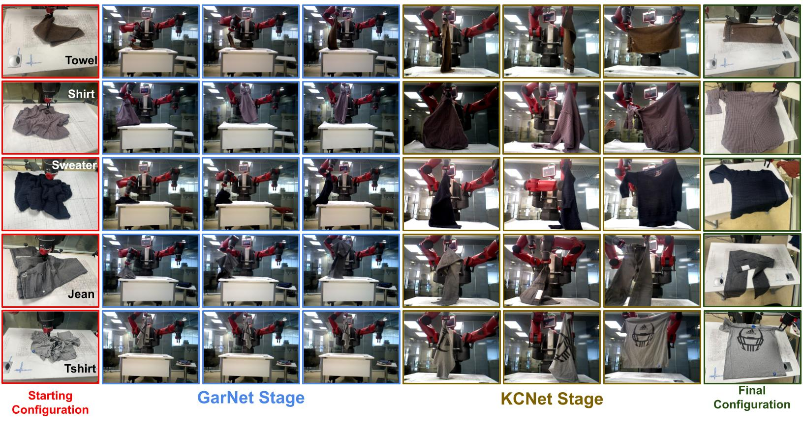
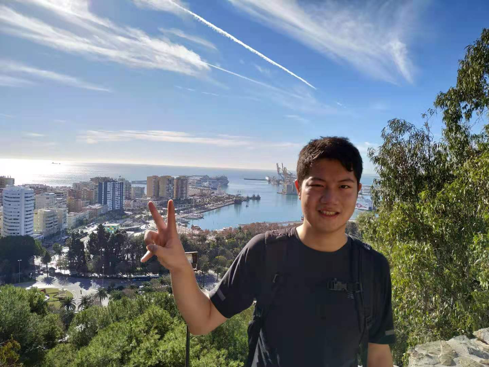

# KCNet-GarNet: A Data-Centric Approach For Dual-Armed Robotic Garment Flattening
## Abstract
Robotic garment flattening is a challenge in research due to that garments have infinite numbers of object states. We propose learning known configurations of garments and using pre-designed manipulation plans to flatten those garments. We propose learning the shapes of garments before recognising the known configurations of garments by a garment similarity network. We validate our approach by demonstrating several garment flattenings with a dual-armed Baxter robot.

## Video Demonstration
<iframe width="560" height="315" src="https://www.youtube.com/embed/VzGj0BML9ro" title="YouTube video player" frameborder="0" allow="accelerometer; autoplay; clipboard-write; encrypted-media; gyroscope; picture-in-picture" allowfullscreen></iframe>

## Examples of 'Known Configurations' Manipulations

## Downloads
\
 [<a taget="_blank" title="Paper" href="https://www.overleaf.com/read/ttsfcwnfxvwp">Paper</a>][<a taget="_blank" title="Code" href="https://github.com/LiDuanAtGlasgow/KCNet-GarNet">Code</a>][<a taget="_blank" title="Database" href="https://gla-my.sharepoint.com/:u:/g/personal/2168518d_student_gla_ac_uk/EWD0yY3jTz9PqkYlepLtK_gB6qwW1lw4D37sAn-E86Rp2w?e=3RJb5y">Database</a>]

 

## The Author
\
My name is Li Duan (Ken), and I am a final year PhD student at the University of Glasgow, Scotland. My interests include robot continuous perception and deformable object manipulation. Recently, I have been working on investigating geometric and physical properties of fabrics and garments, through which I am engineering methods to improve robot deformable object manipulations.\
I am willing to hear from our community, so your suggestions are welcomed. Please reach me at:\
Twitter: [@liduanglasgow](https://twitter.com/liduanglasgow)\
Email: <em>l.duan.1 at research.gla.ac.uk</em>
