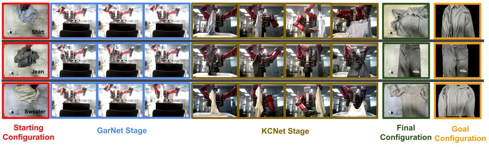

# A Data-Centric Approach For Dual-Armed Robotic Garment Flattening
## Abstract
Garment flattening remains a popular challenge in robotic research. Due to the high dimensionality of object states, garment flattening requires recognising configurations of garments before making manipulation plans to flatten them. In this paper, we propose a data-centric approach to identify known configurations of garments based on a known configuration network (KCNet) trained on depth images that capture the known configurations of garments and prior knowledge on shapes of garments. We found that known configuration recognition accuracy is 92.0%, outperforming our previous work where KCNet is trained only on the depth images (89.0%). We also demonstrate the robotic flattening of garments with our proposed approach.

## Video Demonstration
<iframe width="560" height="315" src="https://www.youtube-nocookie.com/embed/JVWdOAG5WWE?start=1" title="YouTube video player" frameborder="0" allow="accelerometer; autoplay; clipboard-write; encrypted-media; gyroscope; picture-in-picture" allowfullscreen></iframe>

## Examples of 'Known Configurations' Manipulations

## Downloads
 [<a taget="_blank" title="Paper" href="https://www.overleaf.com/read/ttsfcwnfxvwp">Paper</a>][<a taget="_blank" title="Code" href="https://github.com/LiDuanAtGlasgow/KCNet-GarNet">Code</a>][<a taget="_blank" title="Database" href="https://gla-my.sharepoint.com/:u:/g/personal/2168518d_student_gla_ac_uk/EWD0yY3jTz9PqkYlepLtK_gB6qwW1lw4D37sAn-E86Rp2w?e=3RJb5y">Database</a>]

 

## The Author
\
My name is Li Duan (Ken), and I am a final year PhD student at the University of Glasgow, Scotland. My interests include robot continuous perception and deformable object manipulation. Recently, I have been working on investigating geometric and physical properties of fabrics and garments, through which I am engineering methods to improve robot deformable object manipulations.\
I am willing to hear from our community, so your suggestions are welcomed. Please reach me at:\
Twitter: [@liduanglasgow](https://twitter.com/liduanglasgow)\
Email: <em>l.duan.1 at research.gla.ac.uk</em>
